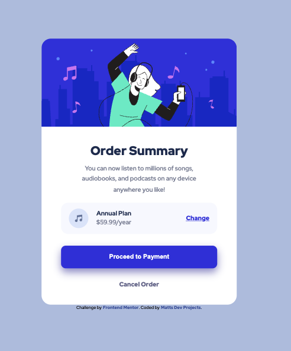

# Frontend Mentor - Order summary card solution

This is a solution to the [Order summary card challenge on Frontend Mentor](https://www.frontendmentor.io/challenges/order-summary-component-QlPmajDUj). Frontend Mentor challenges help you improve your coding skills by building realistic projects. 

## Table of contents

- [Overview](#overview)
  - [The challenge](#the-challenge)
  - [Screenshot](#screenshot)
  - [Links](#links)
- [My process](#my-process)
  - [Built with](#built-with)
  - [What I learned](#what-i-learned)
  - [Continued development](#continued-development)
  - [Useful resources](#useful-resources)
- [Author](#author)
- [Acknowledgments](#acknowledgments)

## Overview

### The challenge

Users should be able to:

- See hover states for interactive elements

### Screenshot

### Links

- Solution URL: [GitHub Code](https://github.com/Matt-LaRochelle/order-summary-component)
- Live Site URL: [Live Site](https://matt-larochelle.github.io/order-summary-component/)

## My process

### Built with

- Semantic HTML5 markup
- CSS custom properties
- Flexbox
- Mobile-first workflow
- Google Fonts
- Checking colors, sizes, and spacing

### What I learned

I am trying to build things that are dynamic and simple. I am abandoning the idea of being pixel perfect and instead going for the "spirit" of the design. While I want things to be as close as possible to the original, it needs to be shaped dynamically. On another note, I am working on different text colors for various sections and find it surprising how much the different colors make the website feel more interesting without bringing attention to itself. It's a subtle thing.

### Continued development

I continue to strive for readability and simplicity in my CSS and I also want to continue to work on understanding color palates and the wide array of options I have for spicing up the website in subtle but meaningful ways.

## Author

- Website - [Matt's Dev Projects](https://mattsdevprojects.com)